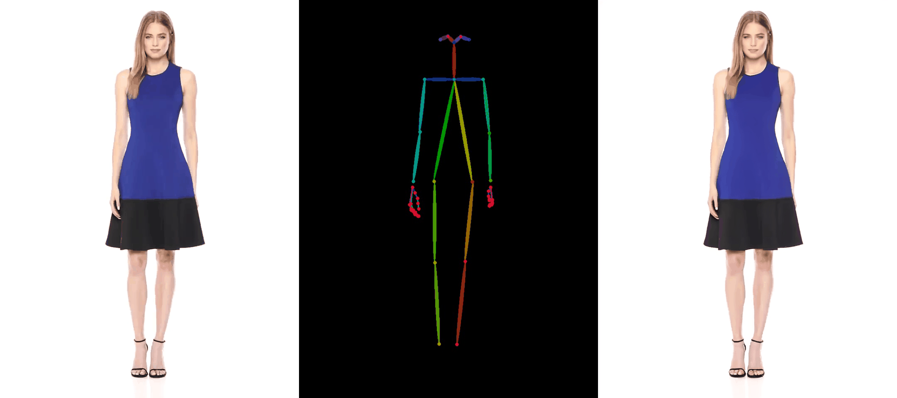
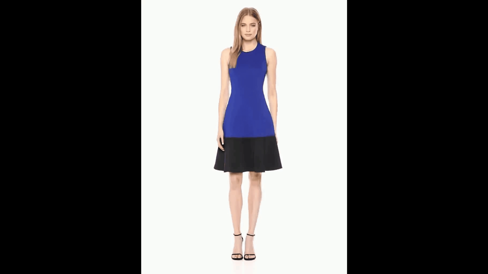

# AnimateAnyone based on Stable Video Diffusion

## Overview
In this project, we provide another easier implement scheme (SVD_PoseGuider) for character animation, such as human dance generation. Different from AnimateAnyone, we adopt SVD (Stable Video Diffusion) as our base model, and inject the pose information to the unet through a temporal-controlnet. The whole training strategy is simplified from two-stages to one-stage.

It's worth noting that this project is a preliminary version, we will continue to develop it and welcome feedbacks and ideas from the community. 

## 🔥 Update
- **[2024.2.5]** The pretrained weights are released.
- **[2024.2.5]** We release the first vision of the code, containing both of the train and inference phases.

## 🗓️ Todo List
We plan to optimize the preliminary model in following ways:
- [ ] Collect more character videos to retrain the model.
- [ ] Optimize the aggregation method for generated clips.
- [ ] Add post-processing of human face.

## Demo
#### UBC_Fashion Demo
| Demo(UBC_Fashion#1)  | Demo(UBC_Fashion#2) |
| ------------- | ------------- |
|   |  |

#### SVD_PoseGuider with Face Embedding (UBC_Fashion#1)
| SVD_PoseGuider  | w_face_enhance  |
| ------------- | ----- |
| | |

#### TikTok Demo
| Demo(TikTok#1)  | Demo(TikTok#2)|
| ------------- | ------------- |
| ||

## Setup
- **Computing resource requirements**: This task needs the support of high memory GPUs. We train the model under the condition of  *A100\*8 with 80g* and inferecence on 1 *v100* with 32g.

- **Installation:**  
We recommend python version >=3.10 and cuda version =11.7. Then install the packages as follows:
```bash
pip install -r requirements.txt
```
- **Pretrained weights:** Download the checkpoint from [Link](https://huggingface.co/dddq/SVD_PoseGuider_v1), and then place them under the directory of `./checkpoint`.

## Inference
 When the pretrained weights are ready, you can run the following cli command:
```bash
python inference.py \
    --pretrained_model_name_or_path="stabilityai/stable-video-diffusion-img2vid-xt" \
    --controlnet_path="./checkpoint" \
    --validation_folder="./validation_demo" \
    --output_dir="./results" 
```
 
## Training
- **Data prepartion:**
Download the [UBC-fashion dataset](https://vision.cs.ubc.ca/datasets/fashion/) and the [Tiktok-dataset](https://www.yasamin.page/hdnet_tiktok#h.jr9ifesshn7v). Then process the dataset with the guidance of [Open-AnimateAnyone](https://github.com/guoqincode/Open-AnimateAnyone?tab=readme-ov-file).  
- **Run command：**
Update the corresponding paths in run.sh and then run:
```bash
sh run.sh
```


<!-- ## Notes
- **Focus on Central Object:** The system tends to extract motion features primarily from a central object and, occasionally, from the background. It's best to avoid overly complex motion or obscure objects.
- **Simplicity in Motion:** Stick to motions that svd can handle well without the controlnet. This ensures it will be able to apply the motion. -->

<!-- ## Training
My example training config is configured like this:
```
accelerate launch train_svd.py \
 --pretrained_model_name_or_path="stabilityai/stable-video-diffusion-img2vid" \
 --output_dir="model_out" \
 --csv_path="path-to-your-csv" \
 --video_folder="path-to-your-videos" \
 --depth_folder="path-to-your-depth" \
 --motion_folder="path-to-your-motion" \
 --validation_image_folder="./validation_demo/rgb" \
 --validation_control_folder="./validation_demo/depth" \
 --width=512 \
 --height=512 \
 --learning_rate=2e-5 \
 --per_gpu_batch_size=8 \
 --num_train_epochs=5 \
 --mixed_precision="fp16" \
 --gradient_accumulation_steps=2 \
 --checkpointing_steps=2000 \
 --validation_steps=400 \
 --gradient_checkpointing
``` -->
## Similar projects
- [Animate anyone](https://github.com/HumanAIGC/AnimateAnyone)
- [Moore-AnimateAnyone](https://github.com/MooreThreads/Moore-AnimateAnyone/tree/master)
- [Open-AnimateAnyone](https://github.com/guoqincode/Open-AnimateAnyone?tab=readme-ov-file)


## Acknowledgements
- Codebase built upon [SVD_Xtend](https://github.com/pixeli99/SVD_Xtend) and [svd-temporal-controlnet](https://github.com/CiaraStrawberry/svd-temporal-controlnet)

## Acknowledgements
Qiu Di: qiudihk@gmail.com
